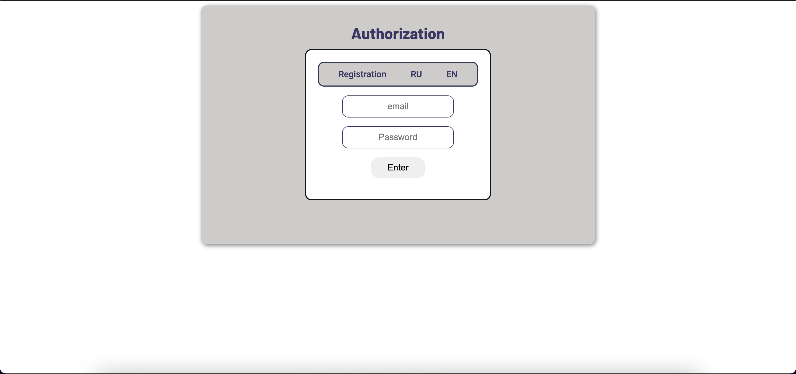

# Taxi

The customer registers in the system and can create a taxi order by specifying the departure address, destination address, number of passengers and car category. 

The taxi service contains a fleet of drivers. The vehicle has a category and can be available: "pre-order", "on a trip" or be inactive.

### For successfully execute the program you should have:
1. [JDK 11.0.2](https://www.oracle.com/java/technologies/javase/jdk11-archive-downloads.html) or upper of date.

### Execution

1. You need [download](https://dev.mysql.com/downloads/workbench/) and install MySQL.

2. Then [download](https://tomcat.apache.org/download-90.cgi) TomCat 9 and store in any place on your computer.

P.S. If you use community Intellij IDEA:
- Setup tomcat on your computer
- Run Intellij and navigate to : File -> Settings -> Plugins
- Search for and install ‘smart tomcat’ from the marketplace (restart Intellij IDEA if prompted)
- Edit run/debug configurations. Add a new configuration of type ‘smart tomcat’ (by clicking on the ‘+’ button). Name the configuration.
- To add a tomcat server : Configuration -> ‘+’ -> Select the path to the local tomcat folder -> apply
- tomcat server -> select from the dropdown
- deployment -> pathToProject/Taxi/src/main/webapp
- Context path -> /
- Configure the ports as required
- Configure the steps to be run before launch. Ex: ‘run maven goal’ -> mvn clean install on C:\Taxi
- Apply and save

4. Restore database from Taxi/src/main/resources/SQLScript/taxi_db.sql file.

- In mySQL Workbench create database using Workbench console and my SQLScript

5. Start project with TomCat.

6. You will see that project was deployed. Then is going to open browser page like (image1).

7. Project is running

### Program output image:

image1:

